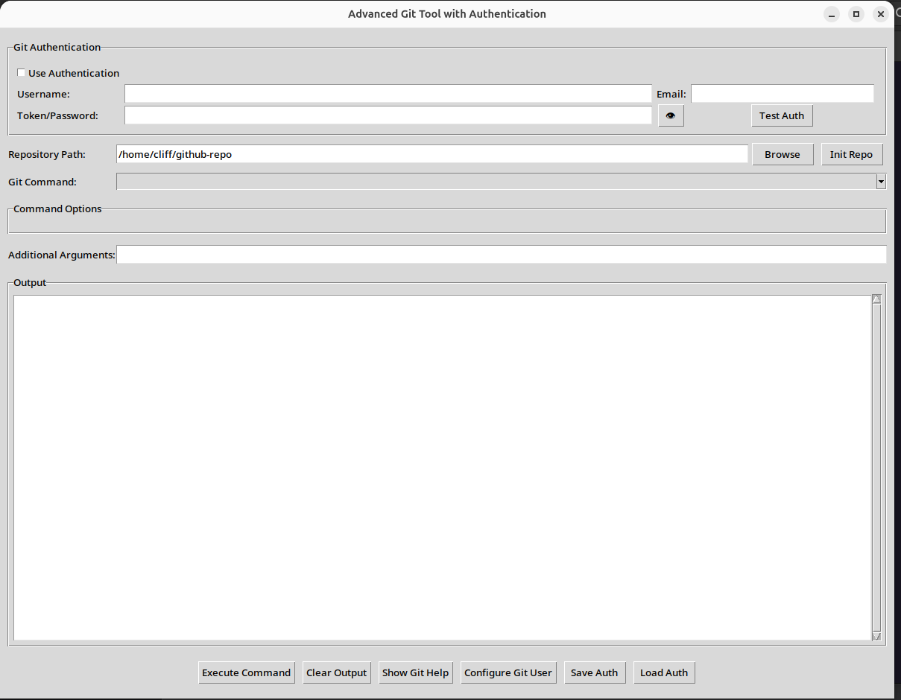

Advanced Git GUI Tool

A comprehensive Python-based graphical user interface for Git operations with authentication support and command-line interface emulation.

https://img.shields.io/badge/Python-3.6%252B-blue https://img.shields.io/badge/Git-2.0%252B-orange https://img.shields.io/badge/License-MIT-green

🚀 Features

🔐 Authentication Management
Secure Credential Storage: Encrypted save/load of GitHub credentials

Multiple Authentication Methods: Personal Access Tokens, username/password

Authentication Testing: Verify credentials against GitHub API

Profile Management: Save and load multiple authentication profiles

Token Visibility Toggle: Secure token input with show/hide functionality

📊 Complete Git Command Coverage
Repository Operations: clone, init, remote, worktree

Basic Snapshotting: add, status, commit, restore, rm, mv

Branching & Merging: branch, checkout, switch, merge, rebase

Sharing & Updating: push, pull, fetch

Inspection & Comparison: log, show, diff, blame

History Manipulation: reset, revert, cherry-pick

Stashing: stash with all options

Configuration: config management

🎯 Advanced GUI Features
Dynamic Interface: Options change based on selected command

Real-time Output: Live command execution feedback

Threaded Execution: Non-blocking GUI during operations

Command Builder: Visual interface for complex Git commands

Repository Browser: Easy directory selection

Help Integration: Direct access to Git documentation

📋 Prerequisites

System Requirements
Python: 3.6 or higher

Git: 2.0 or higher

Operating System: Windows, macOS, or Linux

Python Dependencies
pip install requests
Git Configuration
Ensure Git is installed and accessible from your system PATH:

git --version
🛠 Installation
Method 1: Direct Download
Download the git_gui_tool.py file

Run directly with Python:

python3 git_gui_tool.py
Method 2: Clone Repository
git clone https://github.com/yourusername/advanced-git-gui.git
cd advanced-git-gui
python3 git_gui_tool.py
Method 3: Package Installation (Optional)
# Create virtual environment
python3 -m venv git_gui_env
source git_gui_env/bin/activate  # On Windows: git_gui_env\Scripts\activate

# Install dependencies
pip install requests tkinter  # tkinter usually comes with Python
🔧 Configuration
GitHub Personal Access Token
Go to GitHub Settings → Developer settings → Personal access tokens → Tokens (classic)

Generate new token with appropriate scopes:

repo - Full repository access (recommended)

public_repo - Public repositories only

workflow - GitHub Actions access

Copy the token and save it securely

Initial Setup
Launch the application

Configure Authentication (optional):

Check "Use Authentication"

Enter GitHub username and email

Paste your Personal Access Token

Click "Test Auth" to verify

Use "Save Auth" to store credentials securely

Set Repository Path:

Browse to your Git repository

Or use "Init Repo" to create a new one

🎮 Usage Guide
Basic Workflow
Select Repository: Use browse button or enter path manually

Choose Command: Select from dropdown menu (30+ Git commands available)

Configure Options: Fill in dynamically generated options

Add Arguments: Include any additional command-line arguments

Execute: Click "Execute Command" to run

View Results: Monitor real-time output in the results panel

Common Operations
🔄 Clone Repository
Select clone from command dropdown

Enter repository URL

Optional: Set directory, branch, or depth

Enable authentication if needed for private repos

Click "Execute Command"

💾 Commit Changes
Select commit command

Enter commit message

Choose options:

-a - Commit all changes

--amend - Amend previous commit

--no-verify - Skip hooks

Execute

📤 Push to Remote
Select push command

Set remote and branch (defaults: origin, main)

Options:

--force - Force push

--tags - Push tags

-u - Set upstream

Execute with authentication if required

🌿 Branch Management
Select branch command

Choose operation:

Create new branch

Delete branch (-d or -D)

List branches (-l)

Rename branch (-m)

Enter branch name

Execute

Authentication Features
🔒 Saving Credentials
Fill in username, email, and token

Click "Save Auth"

Choose location for encrypted profile file

Use "Load Auth" to quickly restore settings

🧪 Testing Authentication
Enter credentials

Click "Test Auth"

Verify successful connection shows user information

⚙️ Git User Configuration
Enter username and email

Click "Configure Git User"

Sets global Git configuration for commits

📖 Command Reference
Frequently Used Commands
Command	Description	Common Options
clone	Clone repository	--recursive, --depth
commit	Commit changes	-m, -a, --amend
push	Push to remote	--force, --tags, -u
pull	Pull updates	--rebase, --no-commit
branch	Branch operations	-d, -D, -m, -l
checkout	Switch branches	-b, --force, --detach
merge	Merge branches	--no-ff, --squash
log	View history	--oneline, --graph, -n
stash	Stash changes	push, pop, list, apply
Advanced Operations
Rebase: Interactive rebasing with autosquash

Reset: Soft, mixed, or hard resets

Revert: Reverse commits with edit options

Cherry-pick: Selective commit application

Bisect: Binary search for bugs

Worktree: Multiple working trees

🗂 File Structure
text
advanced-git-gui/
│
├── git_gui_tool.py          # Main application file
├── config.json              # Saved configuration (auto-generated)
├── auth_profiles/           # Authentication profiles directory
│   ├── profile1.json        # Encrypted credential file
│   └── profile2.json        # Additional profiles
└── README.md               # This file
🔒 Security Notes
Token Storage: Credentials are base64-encoded (basic obfuscation)

Local Only: No data is transmitted to external servers

Secure Input: Token field masks input by default

Profile Encryption: Saved profiles use simple encryption

Best Practices
🔑 Use Personal Access Tokens instead of passwords

🗑️ Regularly rotate tokens

📁 Store auth profiles in secure locations

🔒 Use token with minimal required scopes

🚫 Never commit auth profiles to version control

🐛 Troubleshooting
Common Issues
❌ "Git not found"
Solution: Ensure Git is installed and in system PATH

bash
# Verify Git installation
git --version
❌ Authentication Failures
Solutions:

Verify token has correct scopes

Check token expiration

Test with Test Auth button

Ensure username/token combination is correct

❌ Permission Denied
Solutions:

Check repository permissions

Verify SSH keys (for SSH URLs)

Ensure token has repo access

❌ Command Execution Errors
Solutions:

Check output panel for detailed error messages

Verify repository path is correct

Ensure working directory is a Git repository

Debug Mode
For detailed debugging, run from command line:

bash
python3 -u git_gui_tool.py
🚀 Advanced Usage
Command Line Integration
While primarily a GUI tool, you can integrate it with scripts:

bash
# Set environment variables for authentication
export GIT_USERNAME="your_username"
export GIT_TOKEN="your_token"
python3 git_gui_tool.py
Custom Command Templates
Create custom command templates by modifying the build_command_arguments method for specific workflows.

Batch Operations
Use the threaded execution to queue multiple operations while monitoring progress.

📝 Development
Extending the Tool
To add new Git commands or options:

Add to command list in __init__ method

Create setup method following naming pattern setup_{command}_options

Implement argument building in build_command_arguments

Test thoroughly with various scenarios

Example: Adding New Command
python
def setup_custom_command_options(self):
    self.custom_option = self.create_input_field(0, "Custom Option:")

def build_command_arguments(self, command):
    args = []
    if command == 'custom_command':
        if hasattr(self, 'custom_option') and self.custom_option.get():
            args.extend(["--custom", self.custom_option.get()])
    return args
🤝 Contributing
We welcome contributions! Please see our Contributing Guidelines for details.

📄 License
This project is licensed under the MIT License - see the LICENSE file for details.

🙏 Acknowledgments
Git community for extensive documentation

Python tkinter team for GUI framework

GitHub for API access and token management

🔄 Version History
v1.0.0 (2024-01-01)

Initial release with 30+ Git commands

Authentication support

Profile management

Real-time output

Happy Git-ing! 🎉

This tool is designed to make Git operations more accessible while maintaining the power and flexibility of the command line interface.

